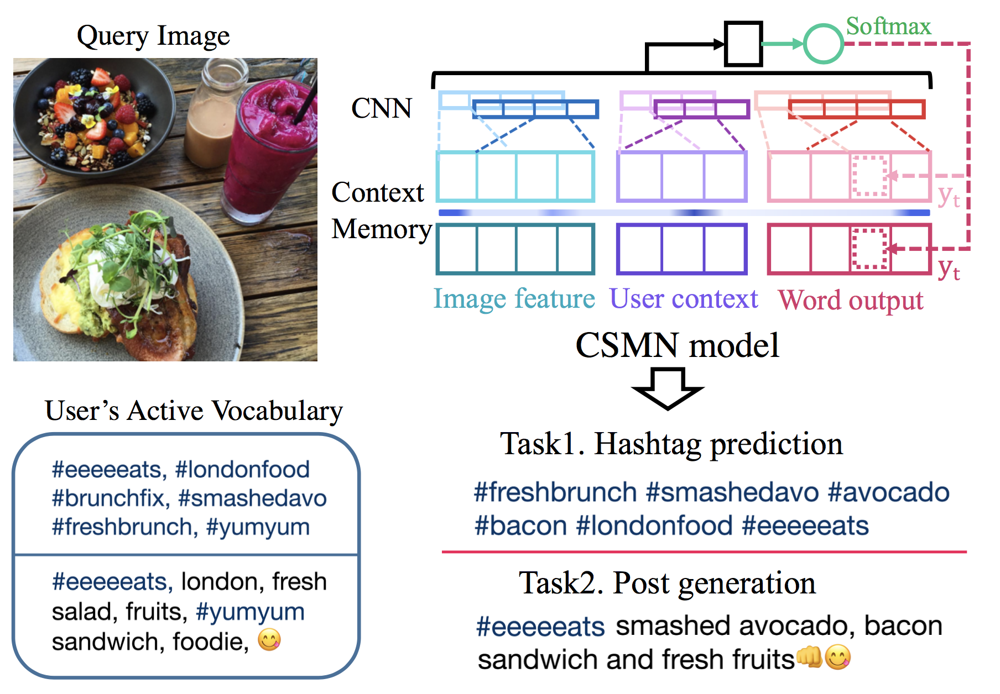
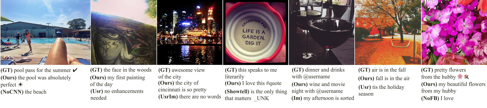
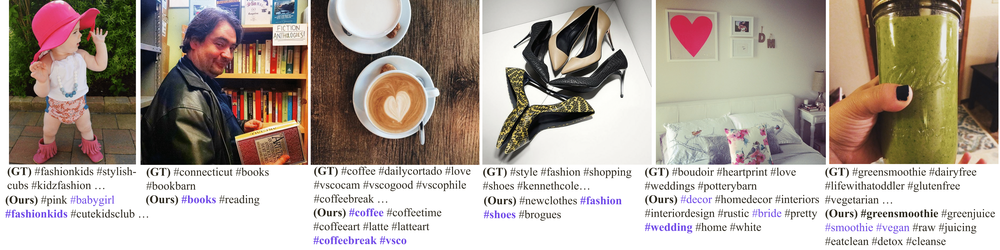
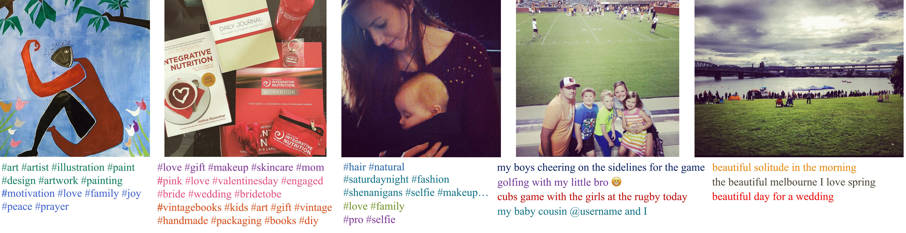
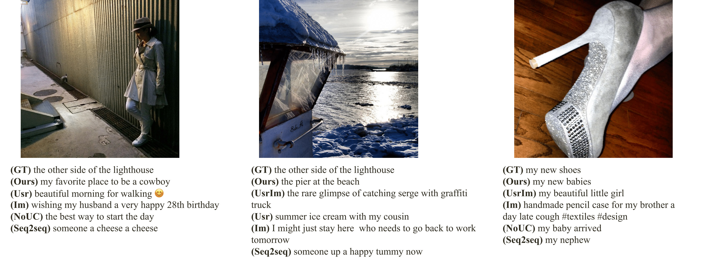
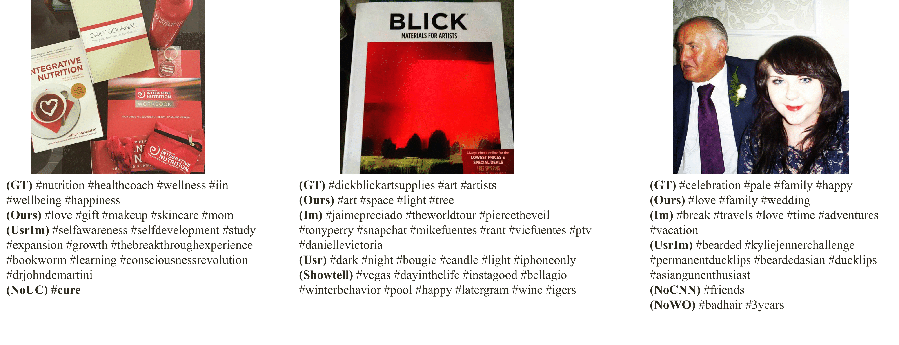

# Attend2u



This project hosts the code for our **CVPR 2017** paper.

- Cesc Chunseong Park, Byeongchang Kim and Gunhee Kim. *Attend to You*: Personalized Image Captioning with Context Sequence Memory Networks. In *CVPR*, 2017. (**Spotlight**) [[arxiv]](https://arxiv.org/abs/1704.06485)

We address personalization issues of image captioning, which have not been discussed yet in previous research.
For a query image, we aim to generate a descriptive sentence, accounting for prior knowledge such as the user's active vocabularies in previous documents.
As applications of personalized image captioning, we tackle two post automation tasks: hashtag prediction and post generation, on our newly collected Instagram dataset, consisting of 1.1M posts from 6.3K users.
We propose a novel captioning model named Context Sequence Memory Network (CSMN).

## Reference

If you use this code as part of any published research, please refer the following paper.

```
@inproceedings{attend2u:2017:CVPR,
    author    = {Cesc Chunseong Park and Byeongchang Kim and Gunhee Kim},
    title     = "{Attend to You: Personalized Image Captioning with Context Sequence Memory Networks}"
    booktitle = {CVPR},
    year      = 2017
}
```

## Running Code

### Get our code

```
git clone https://github.com/cesc-park/attend2u
```

### Prerequisites

1. Install python modules

```
pip install -r requirements.txt
```

2. Download pre-trained resnet checkpoint

```
cd ${project_root}/scripts
./download_pretrained_resnet_101.sh
```

3. Download our dataset

Download data from the links below and save it to `${project_root}/data`.

[[Download json]](https://drive.google.com/uc?export=download&id=0B3xszfcsfVUBdG0tU3BOQWV0a0E)
[[Download images]](https://drive.google.com/uc?export=download&id=0B3xszfcsfVUBVkZGU2oxYVl6aDA)

```
cd ${project_root}/data
tar -xvf json.tar.gz
tar -xvf images.tar.gz
```

4. Generate formatted dataset and extract Resnet-101 pool5 features

```
cd ${project_root}/scripts
./extract_features.sh
```

### Training

Run training script.
You can train the model with multiple gpus.

```
python -m train --num_gpus 4 --batch_size 200
```

### Evaluation

Run evaluation script.
You can evaluate the model with multiple gpus

```
python -m eval --num_gpus 2 --batch_size 500
```

## Personalized Image Captioning Dataset

If you download and uncompress the dataset correctly, structure of dataset will follow the below structure.

```
./data
├── json
│   ├── insta-caption-train.json
│   ├── insta-caption-test1.json
│   ├── insta-caption-test2.json
│   ├── insta-hashtag-train.json
│   ├── insta-hashtag-test1.json
│   └── insta-hashtag-test2.json
└── images
    ├── {user1_id}_@_{post1_id}
    ├── {user1_id}_@_{post2_id}
    ├── {user2_id}_@_{post1_id}
    └── ...
```

We provide two types of dataset, test1 and test2.
Test1 is generated by split whole dataset by user, which means user contexts shown in this testset does not appear in training phase.
Test2 is generated by split whole dataset by posts, which means user context shown in this testset can be appear in training phase.
Since we do not provide validation set, we highly recommend you to split validation set from training set.

Statistics of *Instagram* dataset.
We also show average and median (in parentheses) values.
The total unique posts and users in our dataset are (1,124,815/6,315)

| Dataset       | #posts        | #users        | #posts/user | #words/post |
|:-------------:|:-------------:|:-------------:|:-----------:|:-----------:|
| caption       | 721,176       | 4,820         | 149.6 (118) | 8.55 (8)    |
| hashtag       | 518,116       | 3,633         | 142.6 (107) | 7.45 (7)    |

## Examples

Here are post generation examples:



Here are hashtag generation examples:



Here are hashtag and post generation examples with query images and multiple predictions by different users:



Here are (little bit wrong but) interesting post generation examples:



Here are (little bit wrong but) interesting hashtag generation examples:




## Acknowledgement

We implement our model using [tensorflow](http://tensorflow.org) package. Thanks for tensorflow developers. :)

We also thank Instagram for their API and Instagram users for their valuable posts.

Additionally, we thank [coco-caption](https://github.com/tylin/coco-caption) developers for providing caption evaluation tools.

## Authors

[Cesc Chunseong Park](http://vision.snu.ac.kr/cesc/), Byeongchang Kim and [Gunhee Kim](http://www.cs.cmu.edu/~gunhee/)

[Vision and Learning Lab](http://vision.snu.ac.kr/) @ Computer Science and Engineering, Seoul National University, Seoul, Korea

## License

MIT license
